ggplot2 problems
================
Monica Gerber, MPH
March 16, 2018

Problem 1
---------

Here's some fake data

``` r
test_data <- data.frame(stress = factor(c(1, 2, 3),
                                        levels = c(1, 2, 3),
                                        labels = c("Low Stress", "Moderate Stress", "High Stress")),
                        estimate = c(0, .5, 3),
                        lowercl = c(NA, -0.5, 2),
                        uppercl = c(NA, 1.5,  4))
```

Here's my plot

``` r
dodge <- position_dodge(width=0.9)

ggplot(test_data, aes(x = stress, y = estimate, group = 1, colour = stress, shape = stress)) +
    geom_point(position = dodge) +
    geom_errorbar(aes(ymax = uppercl, ymin = lowercl), position = dodge, width = 0.08, size = 1) +
    theme(axis.text.x =  element_blank(),
          axis.ticks.x =  element_blank()) +
    scale_colour_manual(values=c("#f03b20", "#253494", "#000000"), name="") +
    scale_shape(name = "") +
    labs(y = expression(paste("Outcome, ", beta, " (95% CI)")),
         x = "",
         title = "Effect of moderate and high stress on an outcome compared to low stress") +
    theme_bw() +
    geom_hline(yintercept = 0)
```

    ## Warning: Removed 1 rows containing missing values (geom_errorbar).

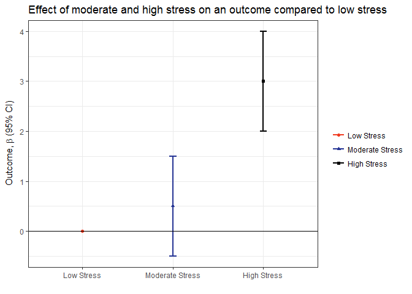

### What's the issue?

My problem: why doesn't removing the x-axis text and tick marks work?

### How I solved it

I solved this but it took me an embarassingly long time to figure out! How did I solve this? I re-wrote each line of the code and looked the plot after each new line until I figured out what was happening. It may be obvious to some but I was clueless.

Here's the new plot! (fill in at R-ladies meeting)

Problem 2
---------

Ok, so what's the best way to create a whole bunch of plots at once?

Because I work in public health I am going to tell you about an example from my work. To check the quality of data I was getting from a community health center, I needed to plot the number of pediatric visits by month using a bar chart. The y-axis is the count of visits and the x-axis is the month. There are 15 community health centers, so I need to do this 15 times.

Here's some fake data

There are three variables:

-   chc = community health center name
-   month = month of observation
-   appts = count of appointments

``` r
chc_data <- data.frame(chc = sort(rep(paste0("CHC", 1:15), 12)),
                       month = rep(seq(as.Date("2017-01-01"), as.Date("2017-12-31"), by="month"), 15),
                       appts = sample(300:800, 15*12, replace = TRUE))


head(chc_data)
```

    ##    chc      month appts
    ## 1 CHC1 2017-01-01   790
    ## 2 CHC1 2017-02-01   573
    ## 3 CHC1 2017-03-01   536
    ## 4 CHC1 2017-04-01   619
    ## 5 CHC1 2017-05-01   479
    ## 6 CHC1 2017-06-01   747

This is what I came up with at first.

``` r
# function for plot
library(dplyr)
```

    ## 
    ## Attaching package: 'dplyr'

    ## The following objects are masked from 'package:stats':
    ## 
    ##     filter, lag

    ## The following objects are masked from 'package:base':
    ## 
    ##     intersect, setdiff, setequal, union

``` r
chc_plot_fun <- function(x){
chc_data %>%
  filter(chc == x) %>%
  ggplot(aes(month, appts)) +
  geom_col() +
  scale_x_date(date_breaks = "1 month", date_labels = "%m-%Y") +
  theme(axis.text.x = element_text(angle = 45)) +
  labs(title = paste0("Number of Visits by Month at Center ", x))}

lapply(paste0("CHC", 1:15), chc_plot_fun)
```

    ## [[1]]

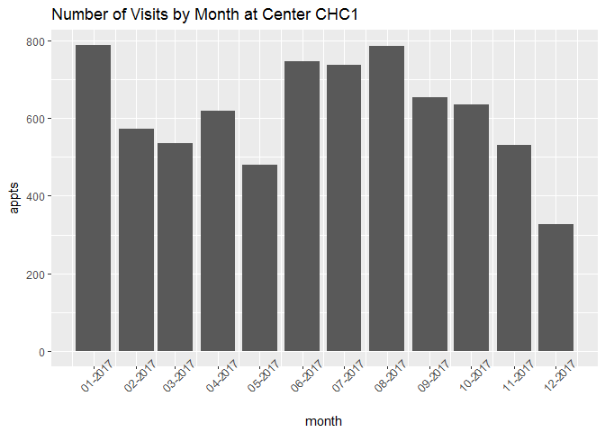

    ## 
    ## [[2]]


    ## 
    ## [[3]]


    ## 
    ## [[4]]

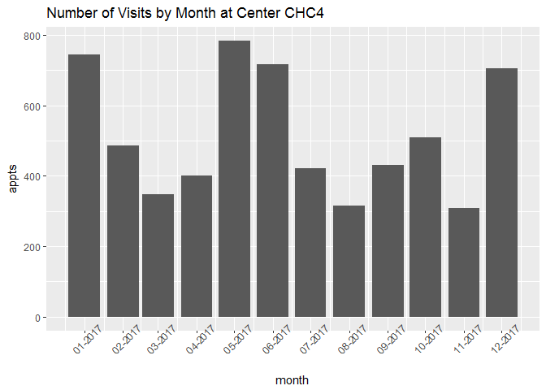

    ## 
    ## [[5]]


    ## 
    ## [[6]]

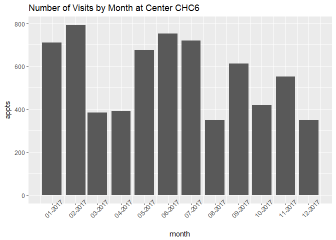

    ## 
    ## [[7]]

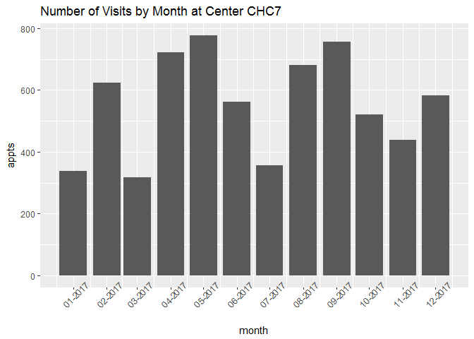

    ## 
    ## [[8]]

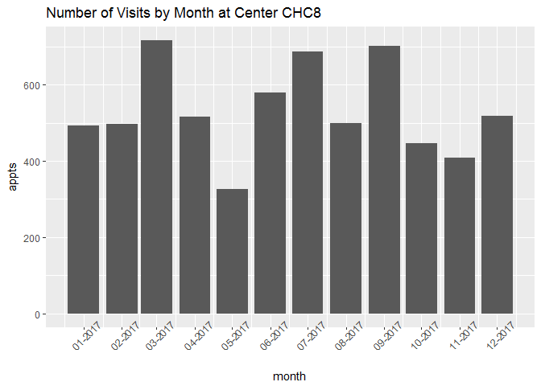

    ## 
    ## [[9]]


    ## 
    ## [[10]]

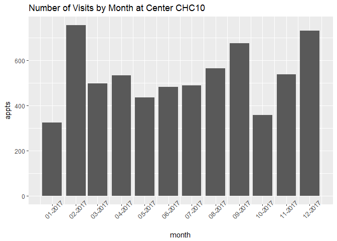

    ## 
    ## [[11]]


    ## 
    ## [[12]]

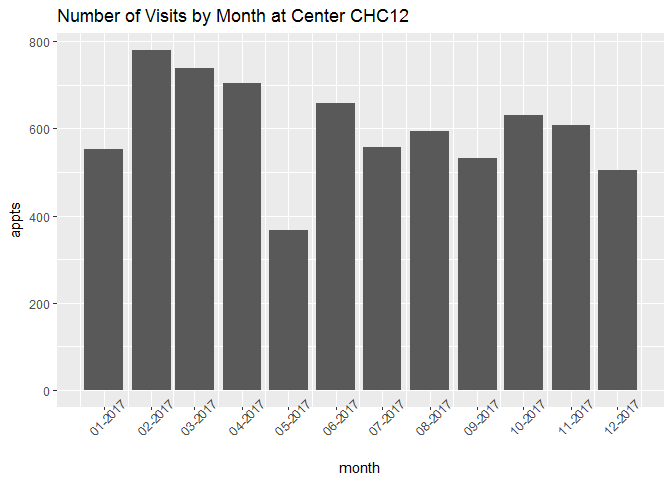

    ## 
    ## [[13]]

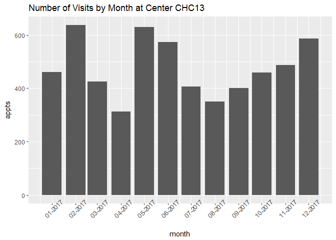

    ## 
    ## [[14]]

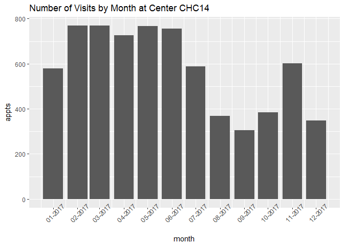

    ## 
    ## [[15]]

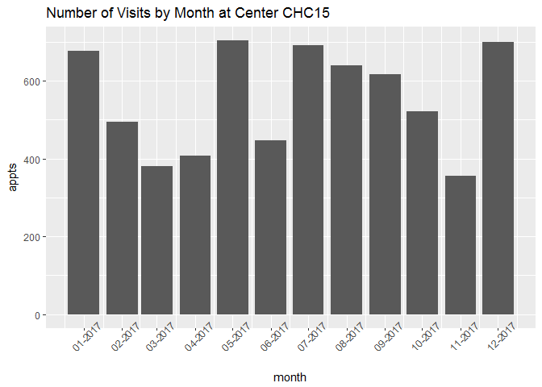

But maybe I can do this with grouped data instead of lapply?!

``` r
chc_data %>%
    group_by(chc) %>%
    ggplot(aes(month, appts)) +
    geom_col() +
    scale_x_date(date_breaks = "1 month", date_labels = "%m-%Y") +
    theme(axis.text.x = element_text(angle = 45)) +
    labs(title = paste0("Number of Visits by Month at Center"))
```


That doesn't work.

Maybe just a line chart would look good.

``` r
chc_data %>%
    ggplot(aes(month, appts, colour = chc)) +
    geom_line() +
    scale_x_date(date_breaks = "1 month", date_labels = "%m-%Y") +
    theme(axis.text.x = element_text(angle = 45)) +
    labs(title = paste0("Number of Visits by Month at Centers"))
```


Well. Maybe if my fake data wasn't just random numbers.

Dot?

``` r
chc_data %>%
    ggplot(aes(month, appts, colour = chc)) +
    geom_point() +
    scale_x_date(date_breaks = "1 month", date_labels = "%m-%Y") +
    theme(axis.text.x = element_text(angle = 45)) +
    labs(title = paste0("Number of Visits by Month at Centers"))
```


Oh, man. Maybe I just need `purrr`. (@\#$%^, should have gone to that last meet-up.)

Problem 3
---------

3d charts! :anguished:

Do you have a better idea?

Here's a figure I was asked to reproduce:


